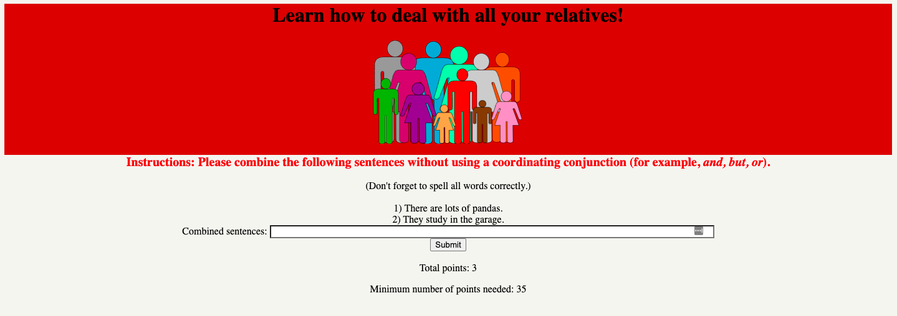

# My first website: a CALL tool



This was the very first public-facing website that I ever built. It's pretty terrible :sweat_smile:, but the nostalgia gives it a nice touch. :satisfied:

Live url: https://relative-clauses-tool.dingel.dev/

### Background

This is a computer-assisted language-learning (CALL) tool that my classmates and I built in Spring 2018 in a graduate-level seminar at Iowa State University. The goal of the course was to build a CALL tool throughout the semester, starting with identifying a need in the field, conceptualizing a solution, implementing it, and testing it with real users.

Most of the group members (myself included) had little to no programming experience. However, a couple of us were taking an introductory Python course, and one group member had experience with other languages. So, we took on the challenge. :muscle:

After testing out a few automated writing evaluation (AWE) tools, we decided that the world needed a tool for helping English as a Second Language (ESL) students practice "existential _there_ clauses with embedded subject relative clauses". We chose this because ESL students with particular first language (L1) backgrounds (e.g. Taiwanese students) tend to make the following error in English:

> \*There is a dog wants to run.

> (There is a dog _that_ wants to run.)

The goal was to provide such students with malformed sentences (like above) and prompt them to fix them. We provided incremental feedback to the users until they got it right or reached 5 incorrect attempts.

So, this project is our attempt at creating that tool!

We were fortunate enough to have a colleague in Taiwan with ESL students that were willing to try out our tool. Our first users! (And ultimately our last :satisfied:)

### Note on fidelity

I've done my best to keep this project in its _original state_ from what my group created back in Spring 2018, errors and all. The code quality is pretty atrocious, but it's the best we could manage at the time. :laughing:

My reasons for making this repo public, then, are twofold:

1. For demonstration's sake, just for fun
1. To hopefully serve as motivation for anybody in the beginning stages of learning to code. We all have to start somewhere, and we grow from there!

There were a few changes that I had to make in order to make this project public, however:

- Removed private data that we used during the exploratory phase of the project.
- Removed borrowed code that didn't end up in the final product (and which I don't have permission to share)
- Replaced absolute paths with `path/to/dir`
- Removed a few other documents that we created during our exploratory phase that honestly make no sense to me. :laughing:

### Running locally

Requirements:

- Python 3.0
- SQLite

```
cd Interface/
python interface_final.py
```
### Original group members
- Emily Dux Speltz
- Alif Silpachai

Under the guidance of Dr. Evgeny Chukharev-Hudilainen
